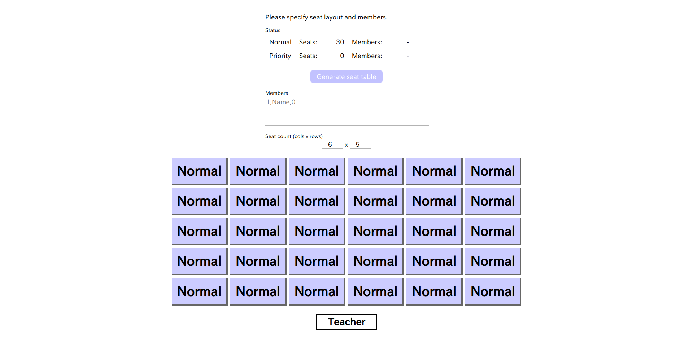
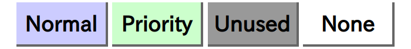
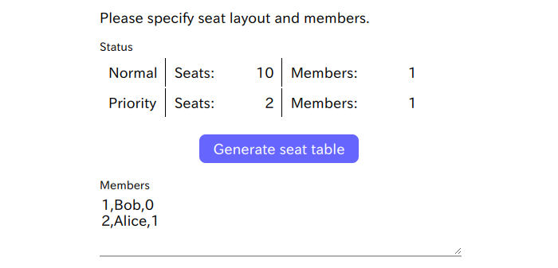
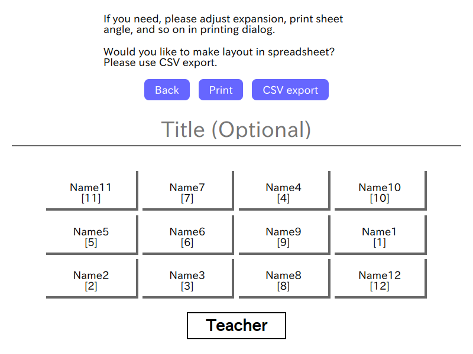

# SeatLottery

English | [日本語](./README_ja.md)

Generate seat table from specified names and seat layout.



## Features

* It written in only plain HTML, CSS and JavaScript. Required only browser and regardless of OS.
* Online resources are unused. So it can works in offline.

## Note

* Unsupported for browsers which unsupported ECMAScript 2015 (ES6) (eg. Internet Explorer).
* Unsupported working on smartphones (mobile browsers).
* Feature of re-generating same result is not implemented. When closed, unsaved (print or export CSV) data will be lost.

## Useage

### 1. Download, Launch

Please clone this repository (download code), and just open `SeatLottery_en.html` in browser.
Japanese version is available in `SeatLottery_ja.html`

No required additional libraries or software.

### 2. Input members

Please input members in the textbox, following this syntax.

```txt
Number,Name,Normal or Priority (0 or 1)
```

Example of input:

```txt
1,Bob,0
2,Alice,1
```

* The "Number" field will not affect to behavior. There no errors will be occure even if duplicates or un sorted.
* Most right column is specifying of normal or Priority. Specify 1 to set priority, and other value to set normal.

### 3. Imput seat layout

Please input seat count of rows x cols.
The field can be set to 1 - 20.
Changing this value, the seat view will be changed.

Click seat block to switch seat type "Normal, Priority, Unused or None".

It assuming like these:

* Normal - Normal seat
* Priority - Priority seat (eg. for hope forward seat)
* Unused - Unused seat
* None - Nothing place




### 4. Generating seat table

"Generate seat table" button will be enabled on these requirements are fulfilled.

* Member input is following correct syntax
* Seat count of rows and columns are specified correct value (1 <= value <= 20)
* Seat count is over than member count (both Normal or Priority)



Click "Generate seat table" button to view result (assigned members in randomly, following layout).



If you need, please fill title and/or note field. If the field is empty, it will be hidden on printing.

It can print by feature of browsers. The feature can also call from "Print" button.
But margin will not be adjusted automatically. If you need, please adjust in printing dialog.

## License

It publishing under [CC0](./LICENSE) license.
