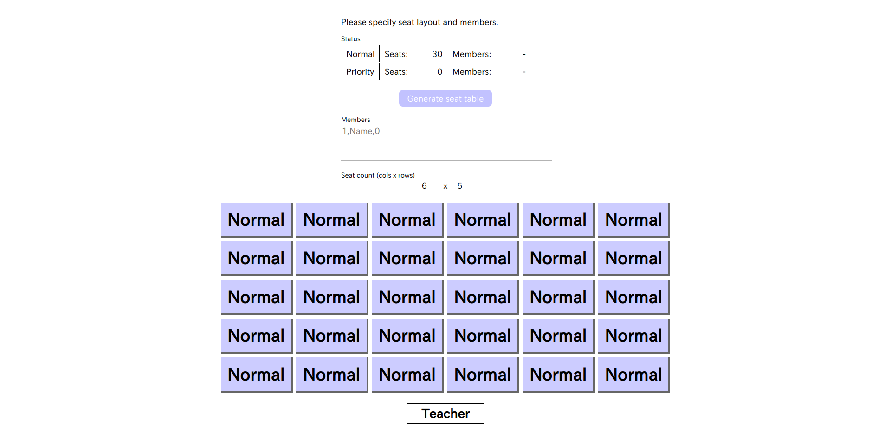

# SeatLottery

English | [日本語](./README_ja.md)

Generate seat table from specified names and seat layout.

## Features

* It written in only plain HTML, CSS and JavaScript. Required only browser and regardless of OS.
* Online resources are unused. So it can works in offline.

## Note

* Unsupported for browsers which unsupported ECMAScript 2015 (ES6) (e.g. Internet Explorer).
* Unsupported for smartphones (mobile browsers).
* Same result re-generating is not implemented. When closed once, unsaved data (printed or CSV exported) will be lost.

## License

It publishing under [CC0](./LICENSE) license.
