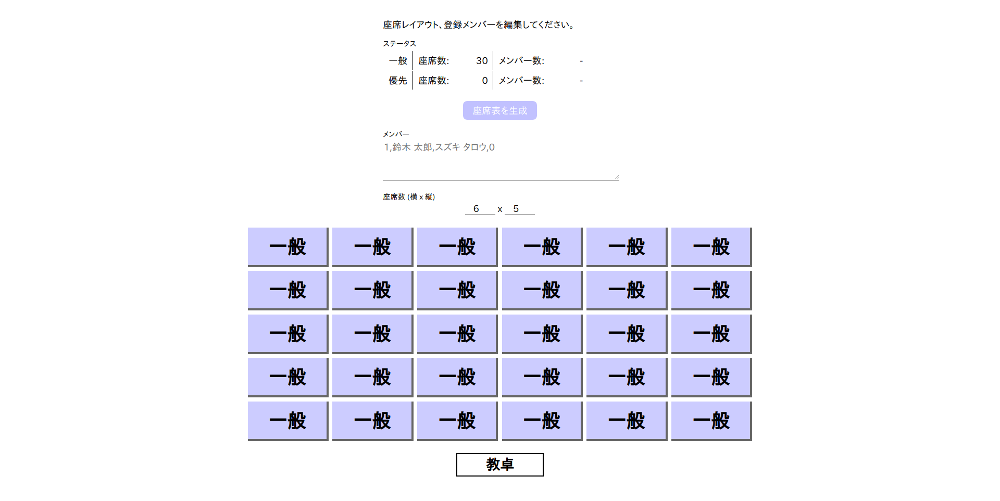

# SeatLottery

[English](./README.md) | 日本語

入力された氏名、座席情報から、席順をランダムに割り振った座席表を生成するプログラムです。

## 特徴

* プレーン HTML、CSS、JavaScript のみで構築されており、サーバを必要とせず、ブラウザの動作する環境であれば、OS を問わずに利用できます。
* オンラインリソース (ライブラリなど) を使用していないため、オフライン上でも動作します。

## 注意

* Internet Explorer をはじめとする、ECMAScript 2015 (ES6) に対応していないブラウザでの動作は保証しておりません。
* スマートフォン (モバイルブラウザ) での動作は保証しておりません。
* 同一の結果を生成する機能は実装しておりません。結果表示を一度閉じると、印刷や CSV などで出力していない結果は失われます。

## ライセンス

本プログラムは、[CC0](./LICENSE) ライセンスの下で配布しています。
