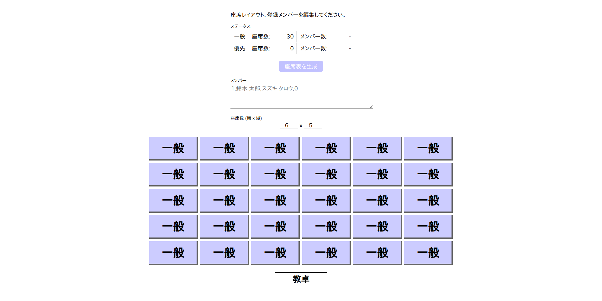
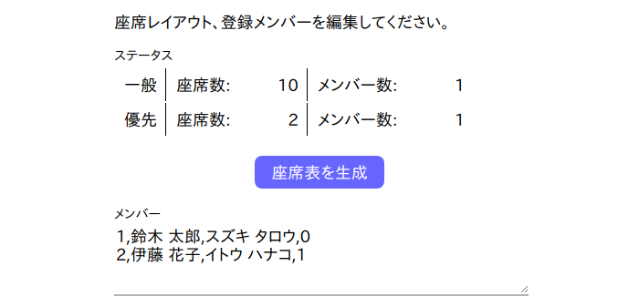
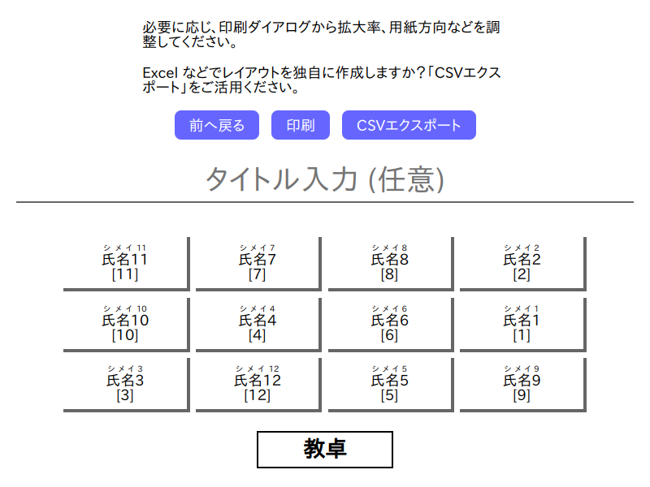

# SeatLottery

[English](./README.md) | 日本語

入力された氏名、座席情報から、席順をランダムに割り振った座席表を生成するプログラムです。



## 特徴

* プレーン HTML、CSS、JavaScript のみで構築されており、サーバを必要とせず、ブラウザの動作する環境であれば、OS を問わずに利用できます。
* オンラインリソース (ライブラリなど) を使用していないため、オフライン上でも動作します。

## 注意

* Internet Explorer をはじめとする、ECMAScript 2015 (ES6) に対応していないブラウザでの動作は保証しておりません。
* スマートフォン (モバイルブラウザ) での動作は保証しておりません。
* 同一の乱数を発生させ、同一の結果を生成する機能は実装しておりません。結果表示を一度閉じると、印刷や CSV などで出力していない結果は失われます。

## 使用方法

### 1. ダウンロード, 起動

本リポジトリをクローン (ソースをダウンロード) し、ブラウザで `SeatLottery_ja.html` を開きます。
英語版は `SeatLottery_en.html` から利用できます。

他に、追加のライブラリやソフトなどは不要です。

### 2. メンバー入力

以下の記法にしたがって、テキストボックスにメンバー入力を行います。

```txt
番号,氏名,フリガナ,優先席指定 (0 or 1)
```

入力例は以下のようになります。

```txt
1,鈴木 太郎,スズキ タロウ,0
2,伊藤 花子,イトウ ハナコ,1
```

フリガナが不要な場合は、以下の形式で記述します。

```txt
番号,氏名,,優先席指定 (0 or 1)
(または)
番号,氏名,優先席指定 (0 or 1)
```

* 番号は、昇順や降順に並べられていなくとも、動作に影響はありません。また、番号が重複していても、文字列などを含んでいても、エラーや警告などは発生しません。
* 左から 4列目のフィールドは、一般席か優先席の指定です。1を指定すると優先席指定、それ以外の値を入力すると一般席指定になります。

### 3. 座席情報入力

縦 x 横の座席数を入力します。
フィールドには、1 から 20 までの整数を入力することができます。
フィールドの値を変更すると、座席表示が変わります。

表示されている座席ブロックを右クリックまたは左クリックすると、座席の種別を「一般, 優先, 未, 空」に変更することができます。
それぞれ、以下のような設定を想定しています。

* 一般 - 通常の座席
* 優先 - 前方希望など、一般席と別枠の座席
* 未 - 未使用の座席
* 空 - 座席が配置されていない箇所


### 4. 座席表生成

以下の条件を満たすと、「座席表を生成」ボタンを押せるようになります。

* メンバー入力が正しい記法に沿っている。
* 座席数に正しい値 (1以上 20以下) が入力されている。
* メンバー数よりも座席数が上回っている。(一般、優先共に)



「座席表を生成」ボタンを押すと、設定された座席表にランダムでメンバーが割り振られた座席表が表示されます。



必要に応じ、タイトル欄や備考欄に必要事項を入力してください。入力が空のときは、印刷時にフィールドが非表示になります。

ブラウザのページ印刷機能、または「印刷」ボタンから、座席表を印刷することができます。
余白は自動調整されないため、必要に応じてブラウザの印刷機能から手動で調整してください。

## ライセンス

本プログラムは、[CC0](./LICENSE) ライセンスの下で配布しています。
