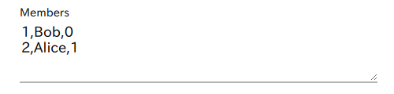
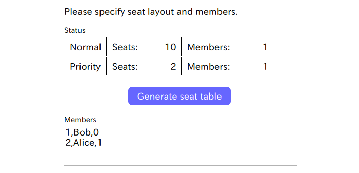
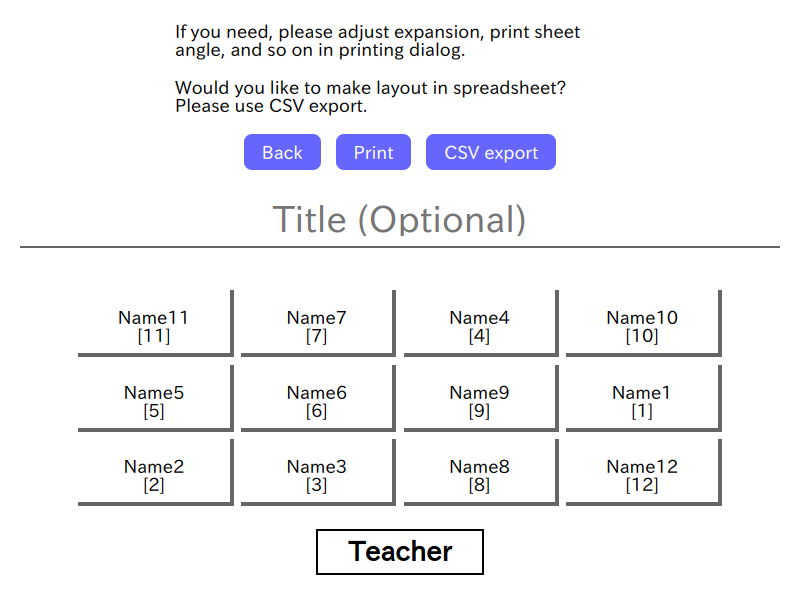

# SeatLottery Usage

## 1. Launch

It's available on online. Just only access to: <https://akuad.github.io/SeatLottery/>

Or you wish use it under offline:

Please clone this repository (download code), and just open `src/index.html` in browser. No additional libraries or softwares are required.

## 2. Input members

Please input members with following this syntax.

```txt
Number,Name,Normal or Priority (0 or 1)
```

Example of input:



Note: The 'Number' field makes no errors when including string, duplicated and/or unsorted.

## 3. Input seat layout

Please input seat count of rows x cols. The field can be set to 1 - 20.

Click (left or right) seat block to switch seat type 'Normal, Priority, Unused or None'.

* Normal - Normal seat
* Priority - Priority seat (eg. for hope forward seat)
* Unused - Unused seat
* None - Nothing place


## 4. Generating seat table

'Generate seat table' button will be enabled on these requirements are fulfilled.

* Member input is following correct syntax
* Seat count of rows and columns are specified correct value (1 <= value <= 20)
* Seat count is over than member count (both Normal or Priority)



Click it to view result. Members will be assigned in randomly with following specified layout.



If you need, please fill title and/or note field. If the field is empty, it will be hidden on printing.

You can print the result by browser function or click 'Print'.

Note: The margin will not be adjusted automatically. If you need, please adjust in printing dialog.
