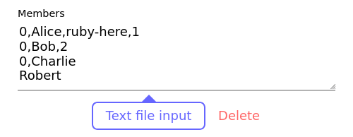
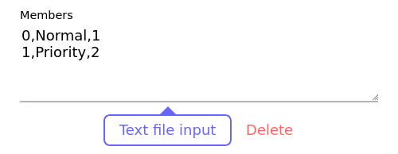
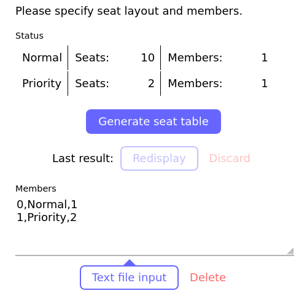
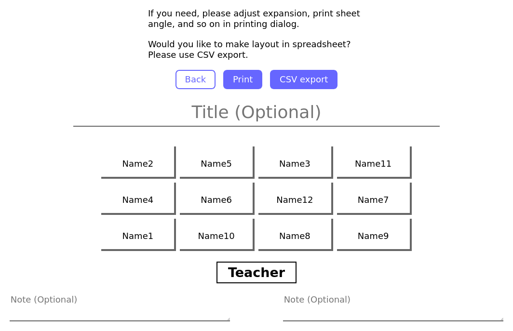
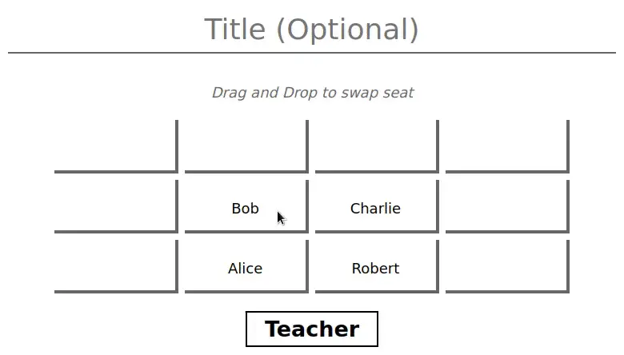
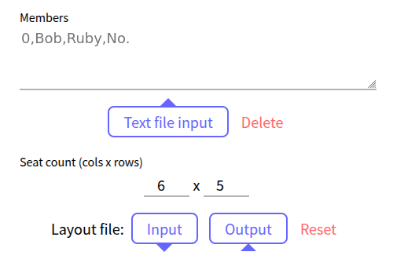

# SeatLottery Usage

English \| [日本語](./ja.html)

## 1. Launch

It's available on online. Just only access to: <https://akuad.github.io/SeatLottery/>

Or you wish use it under offline:

Please clone this repository (download code), and just open `src/index.html` in browser. No additional libraries or softwares are required.

## 2. Input members

Please input members. Syntax is below:

```txt
Priority (0 or 1),Name,Ruby,Number
Priority (0 or 1),Name,Number
Priority (0 or 1),Name
Name
```

Priority, Ruby and Number input is optional.

Example input:





Note: The 'Number' field makes no errors when including string, duplicated and/or unsorted.

## 3. Input seat layout

Please input seat count of rows x cols. The field can be set to 1 - 20.

Click (left or right) seat block to switch seat type 'Normal, Priority, Unused or None'.

* Normal - Normal seat
* Priority - Priority seat (eg. for hope forward seat)
* Unused - Unused seat
* None - Nothing place


## 4. Generating seat table

'Generate seat table' button will be enabled on these requirements are fulfilled.

* Seat count of rows and columns are specified correct value (1 <= value <= 20)
* Seat count is over than member count (both Normal and Priority)



Click it to view result. Members will be assigned in randomly with following specified layout.



If you need, you can swap seat with drag&drop.



If you need, please fill title and/or note field. If the field is empty, it will be hidden on printing.

You can print the result by browser function or click 'Print'.

Note: The margin will not be adjusted automatically. If you need, please adjust in printing dialog.

## Others

### Input auto restore

The members and seat layout input will be store on the browser, then restored automatically at next launch.

If you want to discard these inputs manually (e.g. using at shared PC), please click 'Delete' / 'Reset' button.



Note: On private browse mode, it will be discarded automatically by browser's specification.

### Last result redisplay

You can redisplay last result. It will be store on the browser, then redisplay available even if you close browser.

If you want to discard it manually, click 'Discard' button.

Note: On private browse mode, it will be discarded automatically by browser's specification.
