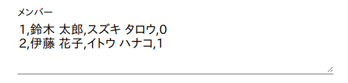

# 使い方

[English](./) \| 日本語

## 1. ダウンロード, 起動

GitHub Pages 上で利用できます。こちらへアクセスしてください: <https://akuad.github.io/SeatLottery/ja.html>

オフラインで利用するには:

本リポジトリをクローン (ソースをダウンロード) し、ブラウザで `src/ja.html` を開いてください。他に、追加のライブラリやソフトなどは不要です。

## 2. メンバー入力

以下の記法にしたがって、テキストボックスにメンバー入力を行います。

```txt
番号,氏名,フリガナ,優先席指定 (0 or 1)
```

入力例:



フリガナが不要な場合は、以下の形式で記述します。

```txt
番号,氏名,,優先席指定 (0 or 1)
(または)
番号,氏名,優先席指定 (0 or 1)
```

Note: 番号は、文字列を含んでいても、昇順/降順に並べられていなくとも、番号が重複していても、エラーや警告などは発しません。

## 3. 座席情報入力

縦 x 横の座席数を入力します。フィールドには、1 から 20 までの整数を入力することができます。

座席ブロックを右クリックまたは左クリックすると、座席の種別を「一般, 優先, 未, 空」に変更することができます。

* 一般 - 通常の座席
* 優先 - 前方希望など、一般席と別枠の座席
* 未 - 未使用の座席
* 空 - 座席が配置されていない箇所


## 4. 座席表生成

以下の条件を満たすと、「座席表を生成」ボタンを押せるようになります。

* メンバー入力が正しい記法に沿っている。
* 座席数に正しい値 (1以上 20以下) が入力されている。
* メンバー数よりも座席数が上回っている。(一般、優先共に)


「座席表を生成」ボタンを押すと、設定された座席表にランダムでメンバーが割り振られた座席表が表示されます。


必要に応じ、タイトル欄や備考欄に必要事項を入力してください。入力が空のときは、印刷時にフィールドが非表示になります。

ブラウザのページ印刷機能、または「印刷」ボタンから、座席表を印刷することができます。

Note: 余白は自動調整されないため、必要に応じてブラウザの印刷機能から手動で調整してください。
